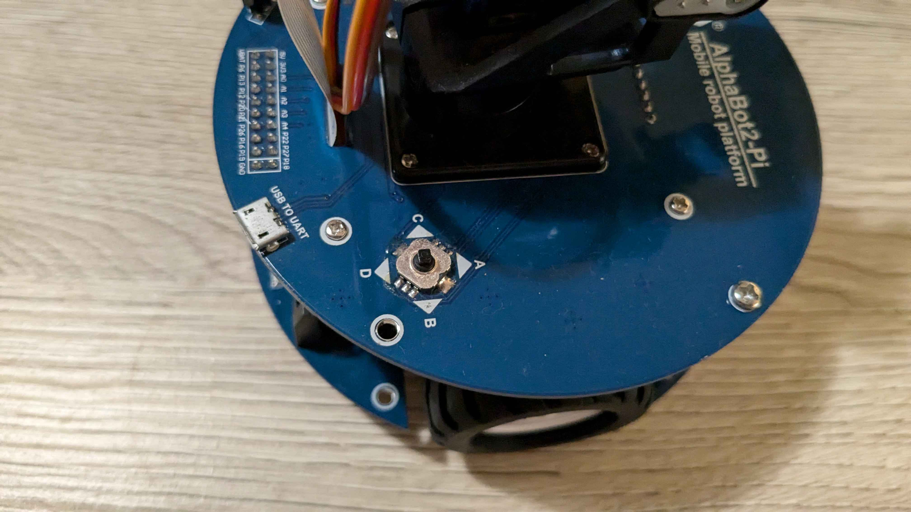
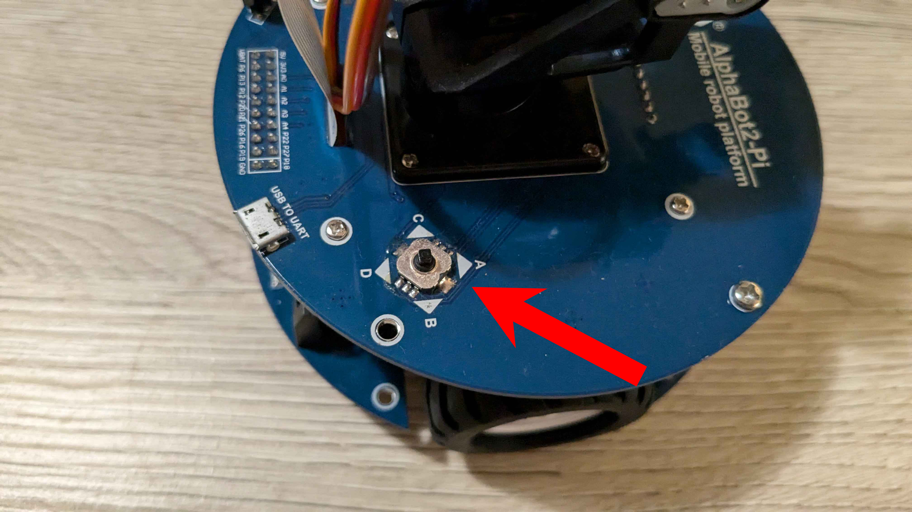

:source-highlighter: highlight.js
:toc:
:toc-title: Inhaltsverzeichnis

= Follow-Me-Fahrroboter User Guide

== Ziel des Handbuchs

Dieses Handbuch soll Nutzern helfen, die Software für den Follow-Me-Fahrroboter zu bedienen. Bitte beachten Sie, dass die Interaktionsmöglichkeiten mit dem Roboter begrenzt sind.

== Einführung

Der Follow-Me-Fahrroboter ist ein autonomer Roboter, der entwickelt wurde, um einer Person zu folgen. Es handelt sich um einen Prototypen einer Machbarkeitsstudie, daher sind die Interaktionsmöglichkeiten minimal.  Diese Anleitung bietet eine kurze Übersicht über die Nutzung der Software sowie einige Debugging-Kommandos.

== Wichtige Aufgaben

=== Roboter starten:

*Roboter mit Strom versorgen*

* Raspberry Pi 4B / Alphabot
** Zuerst müssen Sie den Roboter aktivieren, indem Sie auf den schwarzen Joystick, der mit A,B,C & D umrandet ist, drücken. 

* Jetson Nano / Arduino
** Als erstes müssen Sie den Roboter per USB mit einer Powerbank verbinden. Falls Ihnen keine Powerbank zur Verfügung gestellt wurde, wenden Sie sich an Ihren Systemadministrator. 
** Verbinden Sie die Powerbank mit dem orangefarbenen Kabel des Jetson Nano.

image::../Documentation/deployment/images/Raspberry_Pi.png[]

Verbindung zum WiFi herstellen::
Der Roboter hostet nach dem Start ein eigenes WLAN. Öffnen Sie auf Ihrem PC die verfügbaren Netzwerke und verbinden Sie sich damit.

Raspberry Pi 4B / Alphabot:::

* Name des Netzwerkes: Alphabot2
* Passwort: ubuntu1234

Jetson Nano / Arduino:::

* Name des Netzwerkes: JetsonNano
* Passwort: jetson1234

Verbindung mit SSH herstellen::
Die Verbindung per SSH wird über die Konsole bzw. die Eingabeaufforderung hergestellt. Gehen Sie dafür in Ihren Speicherort des Projektes und geben Sie cmd in den Verzeichnispfad ein, danach öffnet sich die Konsole  im richtigen Verzeichnis. 
Geben Sie zuerst den Befehl ein, danach werden Sie nach dem Passwort gefragt. Geben Sie darauf das Passwort ein.
Raspberry Pi 4B / Alphabot:::
 
* Führen Sie folgenden Befehl aus:

 ssh ubuntu@192.168.4.1

* Passwort: ubuntu1234

Jetson Nano / Arduino:::

* Führen Sie folgenden Befehl aus:

 ssh jetson@192.168.5.1

* Passwort: jetson

Projekt von der Konsole ausführen::
In derselben Konsole, in der Sie gerade die Befehle für die SSH Verbindung ausgeführt haben, führen Sie die folgenden Befehle nacheinander aus.

 cd ~/ros2_humble/ && source install/setup.bash

 cd ~/ros2_ws/ && source install/setup.bash

 cd ~/ros2_ws/src/camera_package/launch

Raspberry Pi 4B / Alphabot:::

* Führen Sie folgenden Befehl aus:

 ros2 launch follow_me_launch.py

Jetson Nano / Arduino:::

* Führen Sie folgenden Befehl aus:

 ros2 follow_me_arduino_launch.py

Optional: Test der Arduino-Version:::

* Führen Sie folgenden Befehl aus:

 ros2 arduino_test_launch.py

=== Auf Web-Control-Center zugreifen:

Nachdem Sie den Roboter gestartet haben, können Sie auf das Web-Control-Center zugreifen, um die Personenerkennung des Roboters zu überwachen und den Kamera-Feed zu verfolgen. Öffnen Sie dazu einen Webbrowser der neuesten Generation. Wir empfehlen Google Chrome oder Firefox. 

Raspberry Pi 4B / Alphabot::

* Geben Sie die folgende Adresse ein:

 http://192.168.4.1:5000

Jetson Nano / Arduino::

* Geben Sie die folgende Adresse ein:

 http://192.168.5.1:5000

=== Motoren anschalten:

Der Roboter ist aktuell stationär, die Personenerkennung ist jedoch aktiv. Sie können dies im Web-Control-Center verfolgen. Jetzt werden Sie die Motoren aktivieren, damit der Roboter Ihnen folgen kann. Achten Sie darauf, dass keine Hindernisse zwischen Ihnen und dem Roboter stehen und dass er sich auf ebenem Boden befindet, um ein Herunterfallen zu vermeiden.

Raspberry Pi 4B / Alphabot::

Suchen Sie den Joystick, mit dem Sie den Roboter aktiviert haben. 
* Drücken Sie den Joystick zuerst in Richtung des Buchstabens A. Dies zentriert die Motoren. Warten Sie 5 Sekunden.
* Danach drücken Sie den Joystick in Richtung B. Dies aktiviert die Motoren und der Roboter beginnt mit der Personenverfolgung, sobald Sie sich in seinem Sichtfeld befinden. 

Jetson Nano / Arduino::

* Betätigen Sie den kleinen silbernen Kippschalter an Ihrem Arduino. Der Roboter beginnt nun mit der Personenverfolgung, sobald Sie sich in seinem Sichtfeld befinden. 

image::../Documentation/deployment/images/Raspberry_Pi_2.png[]

=== Motoren ausschalten:

Nachdem Sie die Personenverfolgung ausgetestet haben und den Roboter nun beenden wollen, müssen Sie zuerst die Motoren wieder ausschalten.

Raspberry Pi 4B / Alphabot::

* Drücken Sie den Joystick in Richtung B. Dies stoppt die Motoren.

Jetson Nano / Arduino::

* Setzen Sie den silbernen Kippschalter wieder in seine Ausgangsposition. Dies stoppt die Motoren.

=== Roboter ausschalten:

Als letzten Schritt müssen Sie den Roboter wieder ausschalten. Sie können das Web-Control-Center jetzt schließen.

Raspberry Pi 4B / Alphabot::

* Drücken Sie den Joystick nach unten, wie beim Einschalten des Roboters. Dies schaltet den Roboter aus.

Jetson Nano / Arduino::

* Ziehen Sie das orangene Kabel aus dem Jetson Nano. Dies schaltet den Roboter aus.

== FAQ

*Q:* Kann ich den Roboter mit einer anderen Software steuern?

*A:* Derzeit ist der Follow-Me-Fahrroboter nur mit der bereitgestellten Software kompatibel. Anpassungen können jedoch vorgenommen werden, indem Sie die entsprechenden ROS2-Pakete modifizieren.

Für weitere Fragen und Unterstützung, wenden Sie sich bitte an den Systemadministrator.

