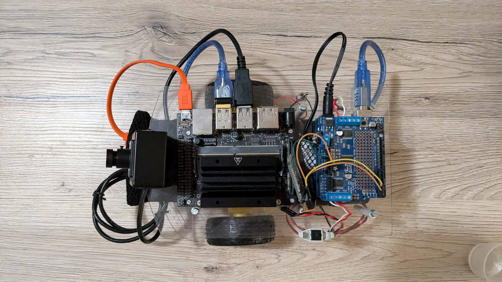

:source-highlighter: highlight.js
:toc:
:toc-title: Inhaltsverzeichnis

= Follow-Me-Fahrroboter User Guide

== Ziel des Handbuchs

Dieses Handbuch soll Nutzern helfen, die Software für den Follow-Me-Fahrroboter zu bedienen. Bitte beachten Sie, dass die Interaktionsmöglichkeiten mit dem Roboter begrenzt sind.

== Einführung

Der Follow-Me-Fahrroboter ist ein autonomer Roboter, der entwickelt wurde, um einer Person zu folgen. Hierbei handelt es sich um einen Protoypen einer Machbarkeitsstudie, die Interaktionsmöglichkeiten sind dementsprechend minimal. Diese Anleitung bietet eine kurze Übersicht über die Nutzung der Software sowie einige Debugging-Kommandos.

== Wichtige Aufgaben

=== Roboter starten:

Roboter mit Strom versorgen::
Raspberry Pi 4B / Alphabot:::

Verbindung zum WiFi herstellen::
Der Roboter hostet nach dem Start ein eigenes WLAN. Öffnen Sie auf Ihrem PC die verfügbaren Netzwerke und Verbinden Sie sich damit.

Raspberry Pi 4B / Alphabot:::

* Name des Netzwerkes: Alphabot2
* Passwort: ubuntu1234

Jetson Nano / Arduino:::

* Name des Netzwerkes: JetsonNano
* Passwort: jetson1234

Verbindung mit SSH herstellen::
Die Verbindung per SSH wird über die Konsole bzw. die Eingabeaufforderung hergestellt. Gehen Sie dafür in Ihren Speicherort des Projektes und geben Sie cmd in den Verzeichnispfad ein, danach öffnet sich die Konsole direkt im richtigen Verzeichnis. 
Geben Sie zuerst den Befehl ein, danach werden Sie nach dem Passwort gefragt. Geben Sie darauf das Passwort ein.
Raspberry Pi 4B / Alphabot:::
 
* Geben Sie diesen Befehl ein:

 ssh ubuntu@192.168.4.1

* Passwort: ubuntu1234

Jetson Nano / Arduino:::

* Geben Sie diesen Befehl ein:

 ssh jetson@192.168.5.1

* Passwort: jetson

Projekt von der Konsole ausführen::
In der selben Konsole, in der Sie gerade die Befehle für die SSH Verbindung ausgeführt haben, führen Sie jetzt folgende Befehle nacheinander aus.

 cd ~/ros2_humble/ && source install/setup.bash

 cd ~/ros2_ws/ && source install/setup.bash

 cd ~/ros2_ws/src/camera_package/launch

Raspberry Pi 4B / Alphabot:::

* Geben Sie diesen Befehl ein:

 ros2 launch follow_me_launch.py

Jetson Nano / Arduino:::

* Geben Sie diesen Befehl ein:

 ros2 follow_me_arduino_launch.py

Optional: Test der Arduino-Version:::

* Geben Sie diesen Befehl ein:

 ros2 arduino_test_launch.py

== FAQ

*Q:* Kann ich den Roboter mit einer anderen Software steuern?

*A:* Derzeit ist der Follow-Me-Fahrroboter nur mit der bereitgestellten Software kompatibel. Anpassungen können jedoch vorgenommen werden, indem Sie die entsprechenden ROS2-Pakete modifizieren.

Für weitere Fragen und Unterstützung, wenden Sie sich bitte an den Systemadministrator.

