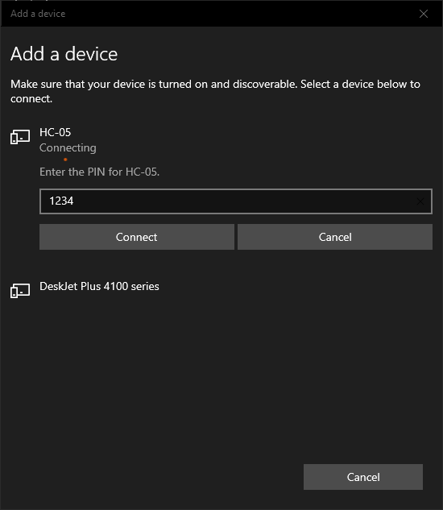
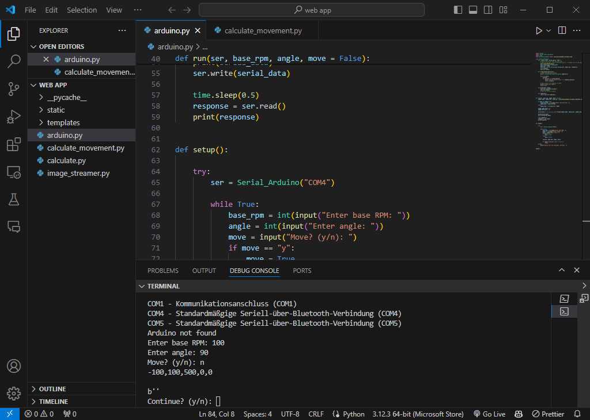

= Test Cases: Follow-Me Fahrroboter

*Test: Movement_calculation_test*

.BITTE HIER NOCH ERGÄNZEN CLAIRE (FALLS NOTWENDIG)
image::arduino_ide_find_out_com_port_1.png[]

.BITTE HIER NOCH ERGÄNZEN CLAIRE (FALLS NOTWENDIG)
image::arduino_ide_find_out_com_port_2.png[]

.BITTE HIER NOCH ERGÄNZEN CLAIRE (FALLS NOTWENDIG)

.BITTE HIER NOCH ERGÄNZEN CLAIRE (FALLS NOTWENDIG)

*Test: Bewegungskalkulation + Verlaufsdokumentation*
include::../Documentation/test/Test_Bewegungskalkulation.adoc[]

include::../Documentation/test/Verlaufsdokumentation_zu_Bewegungskalkulation.adoc[]

*Test: Bilderkennungsdauer + Verlaufsdokumentation*
include::../Documentation/test/Test_Bilderkennungsdauer.adoc[]

include::../Documentation/test/Verlaufsdokumentation_Bilderkennungsdauer.adoc[]

*Test: Humandetection + Verlaufsdokumentation*

include::../Documentation/test/Test_Humandetection.adoc[]

include::../Documentation/test/Verlaufsdokumentation_Humandetection.adoc[]

