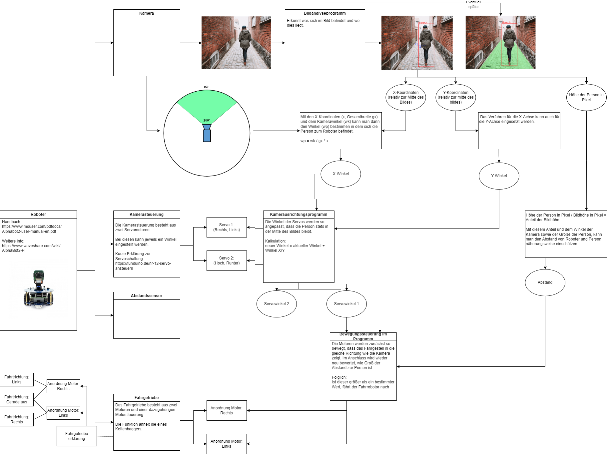

= Dokumentation: Follow-Me-Fahrroboter
 Modulleiter: Herr Prof. Dr. -Ing. Habil. Jürgen Anke; Auftraggeber: Herr. Prof. Dr. -Ing. Mario Neugebauer; Projekt-Coach: Herr Christoph Zirkelbach;
{localdatetime}
include::../_includes/default-attributes.inc.adoc[]

== Allgemein
Dieses Projekt stellt eine Teamarbeit mit Beginn im 3. Semester im Umfang von acht Personen im Modul Software Engineering I und im weiterführenden Modul im 4. Semester Software Engineering II dar. Modulleitung übernimmt niemand geringeres als Herr Prof. Dr.-Ing. Habil. Jürgen Anke; Auftraggeber stellt Herr Prof. Dr.-Ing. Mario Neugebauer dar und unser Projekt-Coach ist Herr Christoph Zirkelbach. 

=== Fristen
**Abgabe Belegarbeit: 26.01.2024**

=== Auftraggeber
Für unser gegebenes Projekt "Follow-Me Fahrroboter" stellt sich Herr Prof. Dr. -Ing. Mario Neugebauer als Auftraggeber bzw. als Product Owner und dient demnach als Hauptansprechpartner.

=== Rollenverteilung
Die Aufgaben wurden hauptsächlich nach Interessen- und Expertisengebieten verteilt und sollen im allgemeinen zum Anreiz dienen gestellte bzw. übernommene Aufgaben auch vollständig und nach bestem Wissen und Gewissen abzuschließen. [WIRD NOCH ERGÄNZT]

=== Ablauf der Kommunikation unter Verwendung von Tools
Wir haben uns als Team darauf verständigt unsere interne Kommunikation in dem von unserem Projektleiter Herr Özer erstellten WhatsApp-Gruppe abzuhalten und diesen auch zum allgemeinen Austausch bei Fragen, Problem und Lösungen zu nutzen. Discord dient hier im gleichen Rahmen. In GitHub überwachen wir unsere gegenseitig gestellten Aufgaben und kontrollieren Projektstruktur. 

=== Teammitglieder
|===
| Teammitglied | Tätigkeitsbeschreibung 
|**Taylan Özer, Wirtschaftsinformatik**| Herr Özer übernimmt die **Projektleitung** und demnach auch administrative Aufgaben. Aufgabenfeld und Tätigkeit sind dynamisch und mit den anderen Projektrollen fließend.

|**Claire Schubert, Wirtschaftsinformatik** | Frau Schubert übernimmt zu Ihrer Tätigkeit als **stellvertretende Projektleitung** ebenfalls die Rolle als **Creative Lead** und **Architect**. Sie teilt des Weiteren Aufgaben den anderen Teammitgliedern zu und dient als Ansprechperson im technischen Zusammenhang mit dem Fahrroboter. 

|**Theresa Stasch, Wirtschaftsingenieurwesen**| Frau Stasch übernimmt zunächst die Aufgabe zur Pflegung des Beleges und im allgemeinen zur Weiterführung der Dokumentation.[NOCH UNVOLLSTÄNDIG] 

|**Johann Marthaus, Wirtschaftsinformatik**| Herr Marthaus übernimmt die Rolle als **Lead Developer** und organisiert sich mit **Jonathan Palermo**, **Danny Miersch** und [NAMEN ERGÄNZEN] zum Aufbau der Bilderkennung für den Fahrroboter.

|**Jonathan Palermo, Wirtschaftsinformatik** | Herr Palermo trägt die Rolle als **Entwickler** und trägt mit zur Entwicklung des Fahrroboters bei und insbesondere in der Bilderkennung.

|**Danny Miersch, Wirtschaftsinformatik** | Herr Miersch trägt die Rolle als **Entwickler** und trägt mit zur Entwicklung des Fahrroboters bei. Herr Miersch übernimmt so auch, weitere Nebentätigkeiten, wie mit unter die Kontrolle des Glossars.

|**Jeremy Ziegert, Wirtschaftsinformatik** | Herr Ziegert trägt die Rolle als **Entwickler** und trägt mit zur Entwicklung des Fahrroboters bei.

| **Luca Kurth, Verwaltungsinformatik** | Herr Kurth trägt die Rolle des **Entwicklers** und trägt mit zur Entwicklung des Fahrroboters bei.
|===

**ALLE TÄTIGKEITEN WERDE NOCH GENAUER UND BESSER BESCHRIEBEN ES KANN NICHT ALSO NOCH WANDLEN - Taylan**

=== Teamstruktur zur 1. Iteration (06.11.2023 - 19.11.2023)

|===
|Team |Teambeschreibung |Teammitglieder
|**Entwicklungs Team I**
|Entwicklungsteam I unter Leitung von Herr Marthaus ist zu Beginn der 1. Iteration (06.11.2023 - 19.11.2023) für die Bilderkennung des Fahrroboters zuständig.
|Johann Marthaus (Gruppenleitung), Luca Kurth, Jonathan Palermo, Jeremy Ziegert

|**Entwicklungs Team II**
|Entwicklungsteam II stellt die Recherche und die Dokumentation zum Roboter Betriebssystem II (ROS II) sicher und überwacht demnach die Schritte zur Implementierung des Betriebssystems.
|Claire Schubert, Danny Miersch
|===

Die Teammitglieder, welche nicht Teil des genanten Entwicklungsteams I und II sind, führen Ihre oben beschriebenen Aufgaben autonom weiterhin fort.

**ALLE TÄTIGKEITEN WERDE NOCH GENAUER UND BESSER BESCHRIEBEN ES KANN NICHT ALSO NOCH WANDLEN - Taylan**

== Iterationen
=== 1. Iteration 06.11.2023 - 19.11.2023 
=== Allgemein
Die Hürde mit Herausgabe aller Projekte und Ihrer Projektleiter am 30.10.2023 bestand darin, zunächst das Team in seiner Gesamtheit erst einmal zusammenzutragen.

**Projektleiter (Taylan Özer):**
So schrieb ich zunächst erst einmal jene Beteiligten für unser Projekt an und wartete circa eine Woche auf eine Rückmeldung aller aus unserem Team - jeder hat sich bei mir zurückgemeldet. Im Anschluss entstand eine WhatsApp-Gruppe, ein GitHub-Repository (geforked von Herr Prof. Anke und Herr Zirkelbach) und ein Discord-Server - unsere interne Kommunikation stand. Ich kümmerte mich demnach auch um unser erstes Auftraggeber-Gespräch mit Herr Prof. Neugebauer und etwa zwei Tage später um ein Projekt-Coach Gespräch.

**Schwierigkeiten Projektleiter**
Bestandteil dieser Iteration war auch ein Projekt-Coach Gespräch und diesem kamen wir auch zeitnah nach. Herr Zirkelbach erklärte uns als Team, dass es zunächst wichtig ist Rollen festzulegen und nicht all zu steif auf ein Konzept zu beharren, nicht bevor wir das erste Auftraggebergespräch geführt hätten. Wir gingen Herr Zirkelbachs Tipps nach und warteten auf das sehnlichst herbeigesehnte erste Gespräch mit Herr Prof. Neugebauer als unser Auftraggeber. 

- Zu diesem Zeitpunkt stand für uns als Team erst einmal die Rollenverteilung und die allgemeine Arbeitsstruktur klar und danach orientierten wir uns zunächst.

- Erwähntes Auftraggebergespräch fand zunächst erst einmal an zwei der geplanten Zieltage nicht statt, aufgrund dessen das Herr Neugebauer diese aus persönlichen Gründen hat verschieben      müssen. 

=== Zielstellung mit dem Ende der 1. Iteration (06.11.2023 - 19.11.2023) in Übergang zur 2. Iteration (20.11.2023 - 04.12.2023) 
- Am 17.11.2023 konnten wir unser geplantes Treffen mit Herr Prof. Neugebauer nachgehen und dieses ergab dann auch folgende Punkte für uns:

- Klärung Aufbau des Alphabot 2 (Fahrroboter),
- Klärung Betriebssystem -> Raspi OS oder ROS 2?,
- Klärung OpenCV -> zwecks Bilderkennung,
- Klärung unseres Bilderkennungskonzepts (angehängt in der Dokumentation)

=== Einbindung Bilderkennungskonzept

*Hinweis:*
 Das Bilderkennungskonzept wurde durch Frau Schubert entwickelt und durch unseren Auftraggeber in unserem ersten Auftraggebergespräch am 17.11.2023 bestätigt.

In Zustimmung mit unserem Auftraggeber sind für unser 3. Semester die Zielstellung wie folgt:

Die Allgemeine Zielstellung für dieses Semester in Absprache mit Herr Prof. Neugebauer für Software Engineering I: Der Fahrroboter soll in seiner Gesamtheit mit einem beliebigen OS (Raspi OS oder ROS 2) stehen und wir sollen uns zunächst auch bereits fortführend um die Bilderkennung des Fahrroboters kümmern. 

- Ein zweites Auftraggebergespräch ist zum 15.12.2023 (Freitag) um 10:30 Uhr anberaumt.
