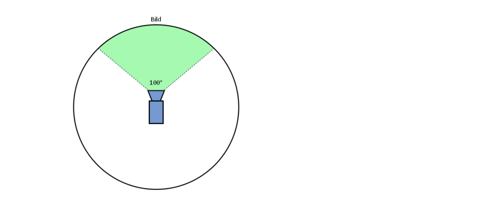
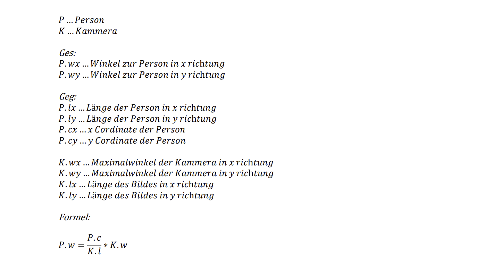
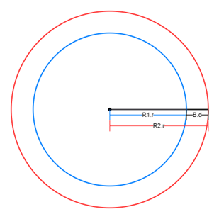
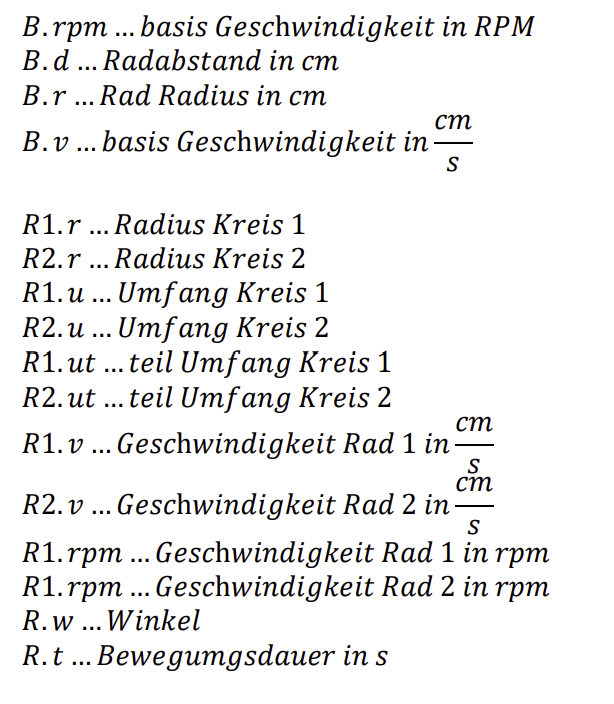
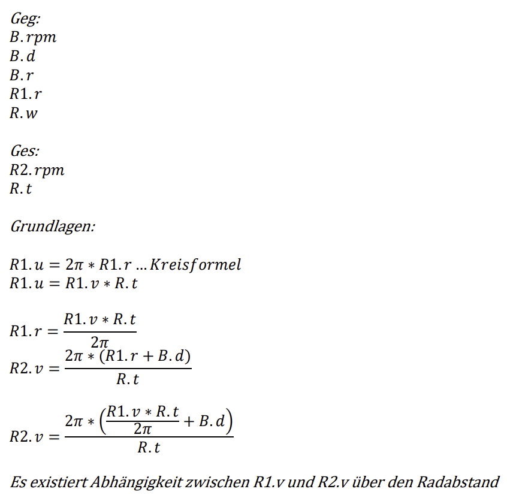
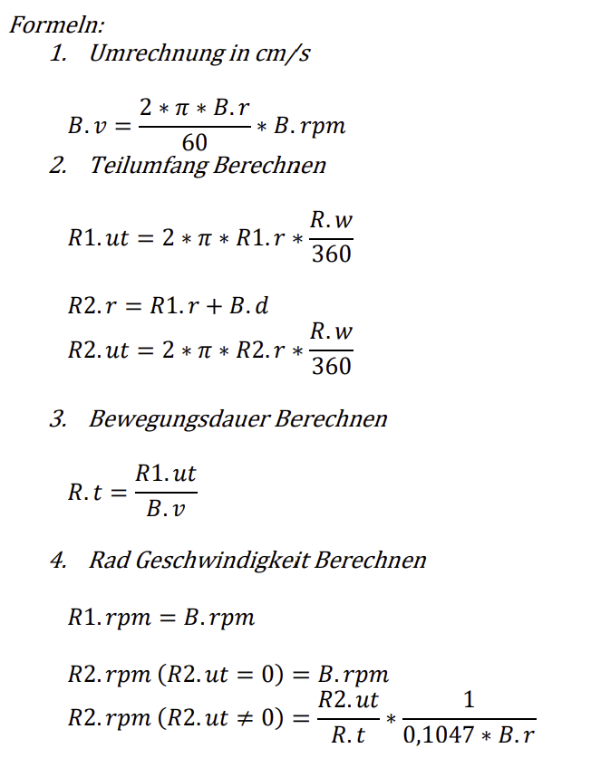

= Formeln zur Berechnung von Steuersignalen aus Bilddaten

== Berechnung

=== Winkel zur Person

Der Winkel zur Person wird berechnet indem man den Maximalwinkel der Kamera mit der Dimension des Bildes gleichsetzt und dann mittels Dreisatz den Winkel zur Person aus der Position im Bild berechnet.

=== Geschwindigkeitsberechnung

Die Geschwindigkeit im Verhältnis zum ersten Rad wird berechnet, so dass der Roboter einen bestimmten Winkel fährt. Somit kann man den Roboter mit Hilfe von Winkeln steuern.

