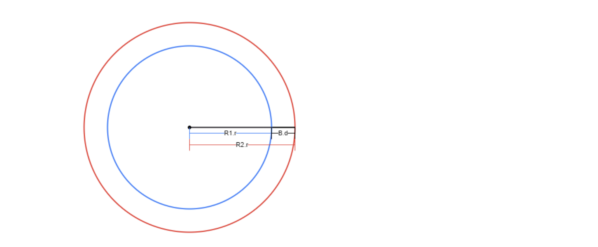
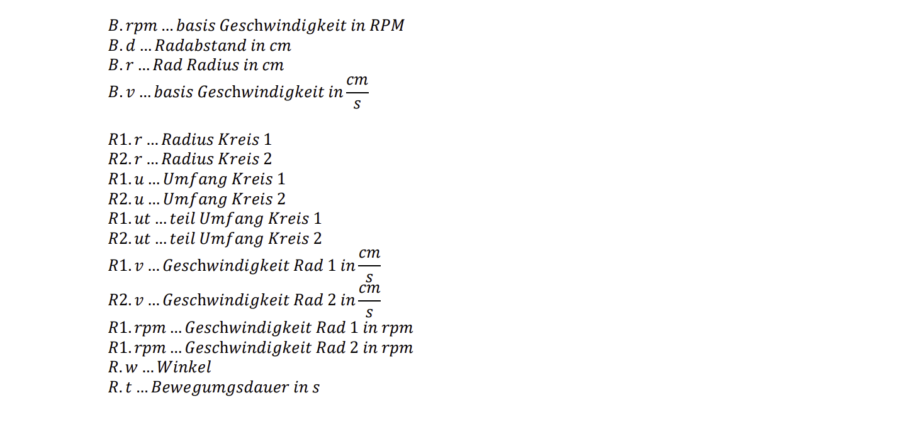
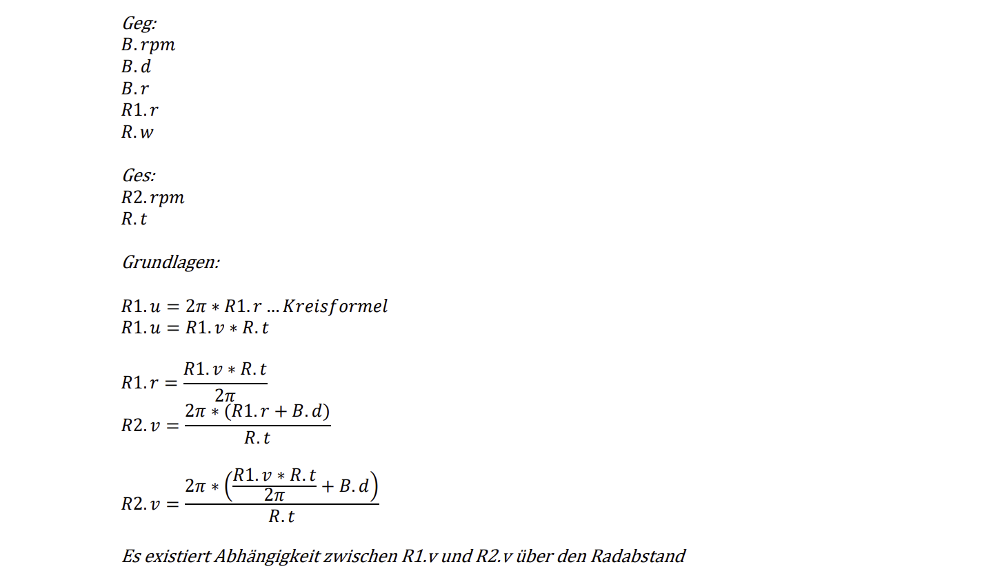
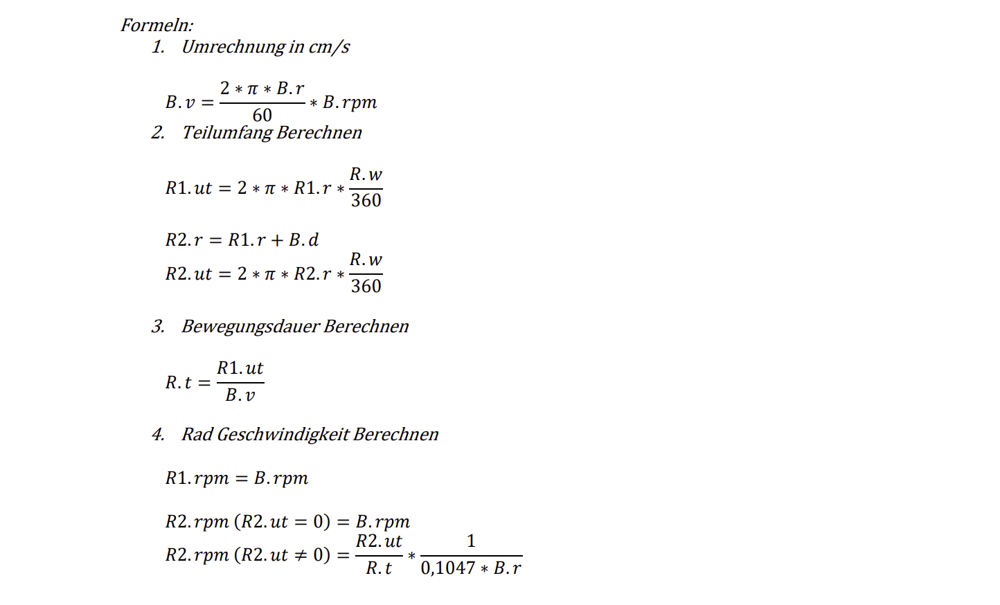

= Formeln zur Berechnung von steuersignalen aus Bilddaten

== Ausgangsdaten

=== Variabl
[cols="1,1,1"]
|===
|Variable
|Bezeichnung im Code
|Beschreibung

|
|coordinate_x
|x-Koordinate der Person

|
|coordinate_y
|y-Koordinate der Person

|
|lenght_x       
|Breite der Person in x-Richtung

|
|lenght_y       
|Länge der Person in y-Richtung

|
|max_x          
|Breite des Bildes in x-Richtung

|
|max_y          
|Länge des Bildes in y-Richtung

|
|move_forward   
|Beshcreibt ob die Person weiter als 2m entfernt ist

|===

=== Statisch

[cols="1,1,1"]
|===
|Variable
|Bezeichnung im Code
|Beschreibung

|
|camera_max_winkel_x
|Maximaler Winkel der Kamera in x-Richtung

|
|camera_max_winkel_y
|Maximaler Winkel der Kamera in y-Richtung

|
|motor_settings_radius
|Innen Radius in cm

|
|motor_settings_wheel_distance
|Abstand der Räder in cm

|
|motor_settings_wheel_radius
|Radius der Räder in cm

|
|motor_settings_correction_factor
|Korrekturfaktor für die Geschwindigkeit

|
|motor_settings_base_rpm
|Basis Geschwindigkeit der Motoren

|===

== Berechnung

=== Winkel zur Person

Der Winkel zur Person wird berechnet indem man den maximalwinkel der Kammera mit der dimension des Bildes gleichsetzt und dann mittels dreisatz den Winkel zur Person aus der Position im Bild berechnet.

image::images/Mathe_Kamera_Berechnung_0.png[]

=== Geschwindigkeitsberechnung

