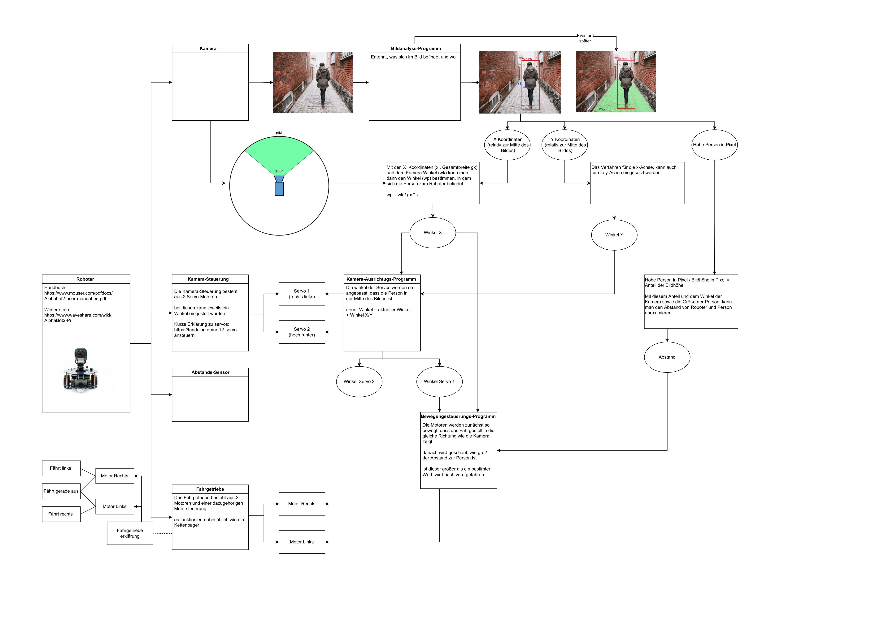

== Entwurf 1

Der erste Entwurf entstand noch vor dem ersten Kundenmeeting und diente dabei als Vorbereitung. Es geht dabei um ein Basiskonzept.

== Entwurf 2

=== Vorgaben
* Verwendung von ROS
    ** Mit ROS ist die grundlegende Struktur unserer Software festgelegt. ROS 2 ist in einem Paket-System strukturiert, welches aus mehreren Nodes besteht (den eigentlichen Softwarekomponenten).
* Verwendung des Alphabot 2
    ** Die Verwendung des Alphabots bringt vor allem Hardware-Anforderungen mit sich

=== Technische Entscheidung
* Verwendung eines vorgefertigten Linux-Images, mit ROS vorinstalliert
    ** Image: Ubiquity Robotics Raspberry Pi Image https://learn.ubiquityrobotics.com/noetic_pi_image_downloads
    ** Pro:
        *** Die Verwendung eines Images spart viel Zeit beim initialen Setup des Systems
        *** ROS funktioniert out of the box
        *** Tests können schneller durchgeführt werden
    ** Contra:
        *** Weniger Anpassungsmöglichkeiten
* Verwendung des ROS for Waveshare Alphabot2 Repository https://github.com/ShaunPrice/ROS_for_Waveshare_Alphabot2
    ** Pro:
        *** Das Repository ist voll entwickelt und kompatibel mit unserem Linux Image
        *** Es ist speziell für den Alphabot geschrieben
    ** Contra:
        *** Es ist mittlerweile 5 Jahre alt

Da dieser Entwurf im Rahmen der Testphase entstand, sind noch keine konkreteren Strukturen entstanden.

== Entwurf 3

=== Bild: Program Design
=== Änderung zum letzten Entwurf
* Das ROS for Waveshare Alphabot2 Repository kann in der aktuellen Form nicht verwendet werden, da es für ROS 1 geschrieben ist, welches auf Python 2 basiert. Das Problem mit Python 2 ist, dass es bald nicht mehr unterstützt wird. Dadurch sind viele modernere Features nicht verfügbar.
Somit Umstieg auf ROS 2.
* Das Linux-Image wird nicht mehr verwendet, da es auf einer veralteten Linux-Version basiert, welche nicht mit ROS 2 kompatibel ist

=== Technische Entscheidung ==
* Verwendung von ROS 2 Humble
** Pro:
*** ROS 2 Humble ist eine der neuesten ROS 2 Versionen
*** Es gibt eine Vielzahl an Software
*** Viele Systeme unterstützen ROS 2
*** Umfangreiche Dokumentation
** Contra:
*** ROS 2 ist im Allgemeinen recht komplex und hat daher eine lange Einarbeitungszeit
* Verwendung von Ubuntu Server 22.04.03 LTS (64 Bit)
** Pro:
*** Das zu ROS 2 Humble empfohlene Operating-System
*** Es ist kompatibel mit einer Vielzahl an Software
*** Eine der aktuellsten Ubuntu-Versionen
** Contra:
*** Es hat keine grafische Benutzeroberfläche
* Verwendung von Python als Programmiersprache
** Pro:
*** Python ist eine von zwei Sprachen, die mit ROS 2 kompatibel sind und deutlich einfacher zu implementieren als die Alternative C++
** Contra:
*** Mit Python kann man in ROS 2 keine eigenen Nachrichtenformate erstellen und ist daher an die Standardformate gebunden
* Übersetzung des ROS for Waveshare Alphabot2 Repository von ROS 1 in ROS 2
** Pro:
*** Das Repository liefert eine gute Grundlage, um zu verstehen, wie ROS Systeme allgemein aufgebaut sind
*** Es enthält eine Vielzahl von Informationen speziell zum Alphabot2
** Contra:
*** Teilweise zu komplex für unseren Anwendungsfall
* Verwendung der ROS2_v4ls_camera https://github.com/tier4/ros2_v4l2_camera/tree/galactic Camera Node
** Es wurde eine Vielzahl an Kamera-Nodes ausprobiert, die meisten sind jedoch für Raspbian geschrieben und funktionieren nicht mit unserem System
** Pro:
*** Funktioniert mit dem System
*** Ist einfach zu installieren
** Contra:
*** Schwer zu konfigurieren
* Verwendung von CV Bridge
** Pro:
*** Ermöglicht die einfache Umwandlung vom ROS 2-Image-Format in das OpenCV-Image-Format

=== Strukturelle Entscheidungen
* Das Modell zeigt den allgemeinen Aufbau des Systems.
* Es gibt eine Node für jede Hardwarekomponente des Alphabot2, welche mittels Messages angesteuert werden kann.
* Außerdem gibt es die camera_subscriber_node, welche das Empfangen und Auswerten der Bilder übernimmt.
* Und die movement_control-Node, welche die ausgewerteten Daten empfängt und in Signale für die Nodes umwandelt, die die Hardware-Komponenten steuern.

== Entwurf 4

=== Bild: Design_v2
=== Änderung zum letzten Entwurf
* Leichte Änderung des strukturellen Aufbaus

=== Strukturelle Entscheidungen

* Aufteilung des Systems in zwei Pakete.
** Diese Entscheidung wurde getroffen, um das System möglichst modular zu gestalten.
** Das ros2_for_waveshare-Paket ist speziell für den Alphabot2 geschrieben und stellt somit eine Art Update des ROS for Waveshare Alphabot2-Repositories dar. Die Idee ist, dass das Paket unabhängig von unserem System mit dem Alphabot2 verwendet werden kann.
** Das camera_package enthält alle Tools zur Bildverarbeitung und Berechnung der Eingangssignale. Da es unabhängig vom ersten Paket funktioniert, könnte man in der Zukunft z. B. recht einfach auf eine andere Plattform umsteigen, ohne den Code stark zu modifizieren.
* Johan soll Informationen zum Human Detector ergänzen.
Entwurf 4 ist der erste funktionale Entwurf und auch der erste Entwurf mit einem Prototyp.

== Entwurf 5

=== Bild: Design_v4-Software overview
=== Technische Entscheidung

* Hinzufügen einer Web-Oberfläche, die die vom human_detector bearbeiteten Bilder anzeigt
** Pro:
*** Das Tool ermöglicht es zu sehen, wie gut das Tracking funktioniert und ist somit unbedingt notwendig für das Debugging.
** Contra:
*** Performanceverlust
* Verwendung von Flask für das Web-Tool
** Pro:
*** Relativ einfache Implementierung in Python
** Contra:
*** Teilweise Kompatibilitätsprobleme mit ROS 2
*** Muss in einem separaten Thread laufen, da es sonst Probleme mit ROS 2 gibt
*** Erhöhter Performancegebrauch durch Threading

Durch die Implementierung des camera_streamers war es deutlich einfacher zu verstehen, wie gut die Erkennung funktioniert. Somit ist uns auch ein großes Problem aufgefallen: die bisher verwendete Kamera hat einen viel zu geringen Winkel für unseren Anwendungsfall, da Personen ungefähr 3 m vom Roboter entfernt stehen müssen, um überhaupt vollständig im Bild erkannt zu werden.
Zudem ist der Bilderkennungsalgorithmus, den wir verwenden, recht ungenau und erkennt Personen entweder nicht oder erkennt Personen in Gegenständen.

== Entwurf 6

=== Bild:
=== Änderung zum letzten Entwurf

* Entfernung der ros2_v4ls_camera-Node
* Austausch der vorinstallierten Kamera auf dem Alphabot2 durch eine USB-Kamera
** Da die vorinstallierte Kamera nicht für unsere Zwecke ausreicht
* Entfernung der Servos
** Die neue Kamera ist zu schwer für die Servos; die dafür gebaute Software bleibt trotzdem im Projekt für eventuelle spätere Benutzung.
=== Technische Entscheidung

* Wechsel zu einer USB-Kamera
** Pro:
*** Bessere Qualität und ein deutlich größerer Winkel
** Contra:
*** Deutlich schwerer, deshalb Entfernung der Servos
*** Höherer Stromverbrauch
* Wechsel zur OpenCV Video Stream capture Funktion
** Pro:
*** Direktes Ansprechen der Kamera in Python möglich
** Contra:
*** Capturing findet permanent statt und kommt somit mit einem gewissen Maß an Performanceverbrauch
*** Die Kamera kann nur im Rahmen einer Node verwendet werden
* Wechsel zu YOLO
** Pro:
*** Bessere Erkennungsgenauigkeit
** Contra:
*** Hoher Performanceverbrauch
*** Ziemlich langsam

Zum aktuellen Zeitpunkt ist noch nicht klar, ob wir YOLO einsetzen können, da es derzeit viel zu langsam ist; die aktuelle Tendenz liegt bei Nein.

== Entwurf 7 Prototyp 2

=== Bild:
=== Änderung zum letzten Entwurf

* Wechsel von Raspberry Pi 4 auf Nvidia Jetson Nano
** Da der Raspberry Pi 4 nicht genug Leistung für YOLO bietet
* Wechsel von Alphabot2 auf Arduino Uno und Adafruit Motor Shield v2.3
** Der Alphabot 2 ist zu klein, um den Jetson Nano zu tragen
** Der Alphabot 2 ist schlecht erweiterbar
* Entfernung des ros2_for_waveshare_alphabot2-Pakets
** Da es nicht mehr benötigt wird
* Wechsel zum Jetson Nano - Ubuntu 20.04-Image
** Der Jetson Nano hat aktuell keine offizielle Unterstützung für Ubuntu 22.04
=== Technische Entscheidung

* Wechsel zum Nvidia Jetson Nano
** Pro:
*** Deutlich mehr Leistung als der Raspberry Pi 4
*** Bessere Unterstützung für YOLO
** Contra:
*** Höherer Stromverbrauch
*** Höheres Gewicht
* Wechsel zum Arduino Uno und Adafruit Motor Shield v2.3
** Pro:
*** Bessere Erweiterbarkeit
*** Es ist deutlich einfacher, Motoren zu steuern
*** Testung ohne den Jetson Nano möglich, über serielle Schnittstelle
** Contra:
*** Kommunikation muss über serielle Schnittstellen stattfinden
        *** komplexere Systemstruktur
* Wechsel auf Jetson Nano - Ubuntu 20.04 image
	** Pro:
		*** Offizielle Unterstützung
		*** Bessere Kompatibilität
	** Contra:
		*** Ältere Ubuntu Version
		*** Weniger Software verfügbar
