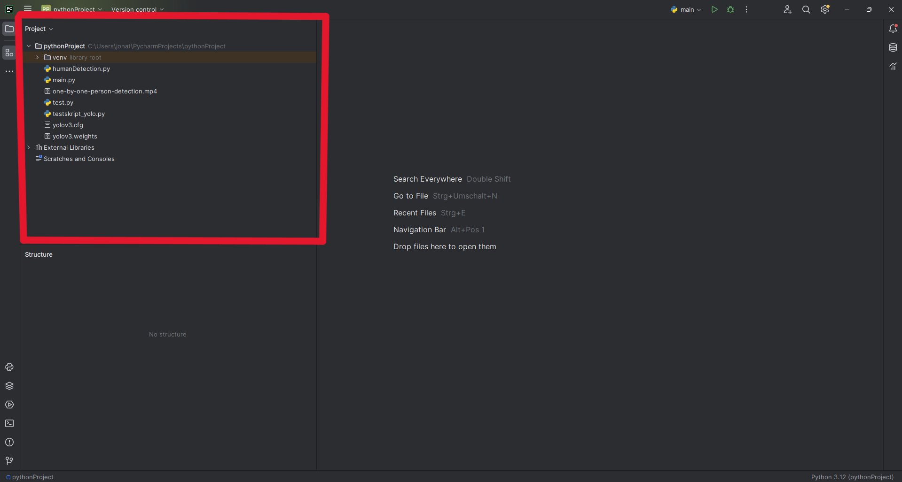
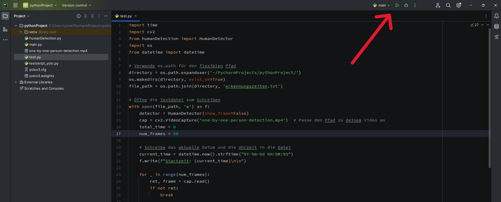
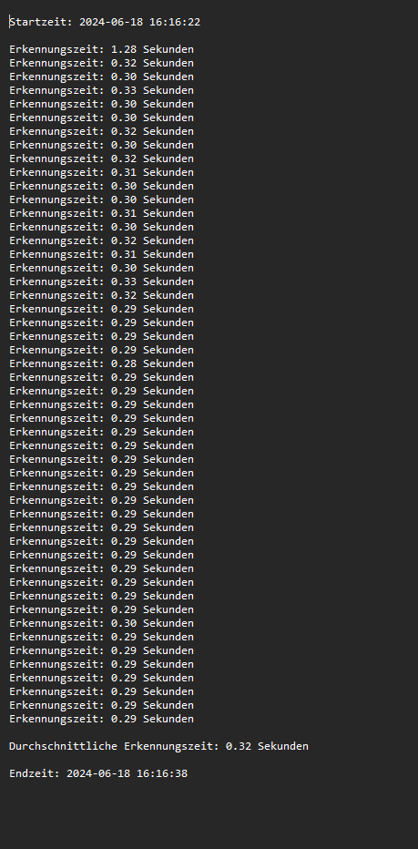
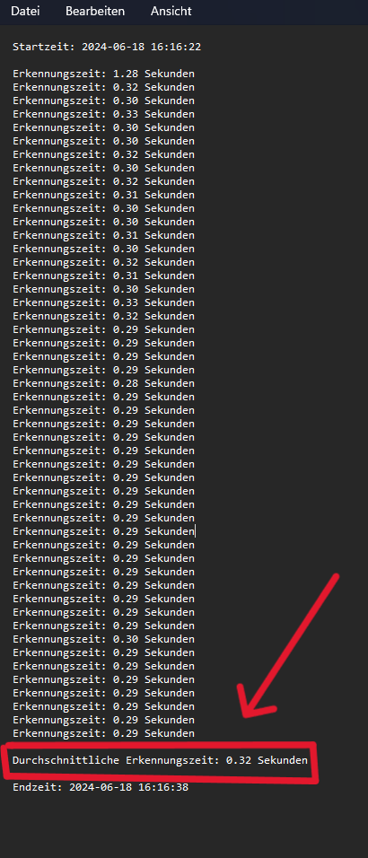

= Durchführung des Test Humandetection

== Ziel

- Ziel ist es die durchschnittliche Zeit von unserer Humandetection zu ermitteln, welche benötigt wird bis eine Person zu erkennen und diese zu tracken.

== Vorbereitung

- Öffnen von der Programmieroberfläche für die Sprache "Python". In diesem Beispiel: "PyCharm Community Edition"
- Danach wird das Verzeichnis geöffnet, wo sich die benötigten Dateien befinden. Alle nötigen .py Dateien, die Video .mp4 Datei, und die yolov3.cfg werden benötigt und MÜSSEN im selben Verzeichnis sein, damit der Test keine Fehler wiedergibt.
- Liste der notwendigen Dateien:
    - test.py
    - humanDetection.py
    - yolov3.cfg
    - main.py
    - one-by-one-person-detection.mp4 (kann auch anderes geeignetes Video zum Testen sein)

== Durchführung

- In dem Verzeichnis befindet sich eine "test.py" Datei, diese ist für die Durchführung des Tests essenziell, weil nur DIE ausgeführt werden muss.
image::images/geoeffnete_test_py_datei.png[]
- Die anderen .py Dateien werden NICHT ausgeführt, sind aber genauso unverzichtbar für den Test, da die "test.py" Datei auf diese .py Dateien zugreift und diese aufruft.
- In der test.py Datei gibt es eine Zeile Code, in der man einstellt, für wie viele Frames die durchschnittliche Zeit ermittelt werden soll, die wie o.g. benötigt wird um Personen aus dem Video zu erkennen.
image::images/markierte_code_zeilen.png[]
- Hier kann man eine beliebige Anzahl von Frames manuell einstellen. In diesem Beispiel testen wir einmal für 50 Frames und einmal für 150 Frames.
- Jetzt wird die test.py AUSGEFÜHRT.

- Die test.py Datei generiert beim Ausführen der Datei eine .txt Datei, in der relevante Werte für BEIDE Frameanzahlen gespeichert werden.
- Einmal Datum und Uhrzeit der Durchführung des Tests, die Zeit, die benötigt wird, eine Person zu erkennen, für die EINZELNEN Frames und am Ende wird die durchschnittliche Zeit für alle Frames wiedergegeben. Dieser Wert ist eigentlich der Schlüsselwert, um das Ziel des Tests zu ermitteln.
- Die Datei wird im selben Verzeichnis gespeichert.

- Test erfolgreich durchgeführt.

== Auswertung

- Daten aus der .txt Datei werden jetzt untersucht, um Erkenntnisse über Funktionalität und Effizienz der Humandetection zu ermitteln.

- 0.32 Sekunden wie in diesem Beispiel ist ein durchaus beachtlicher Wert.
- Man kann allgemein sagen, dass Werte unter 0.5 Sekunden als durchschnittliche Zeit gut und schlussendlich effektiv beim Raspberry Pi sind.
